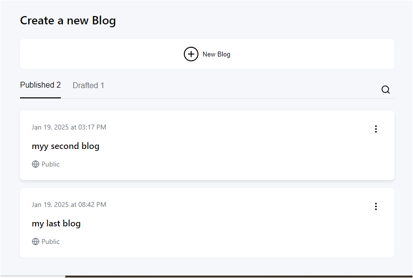
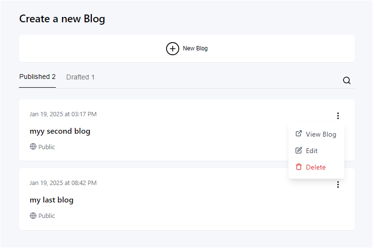
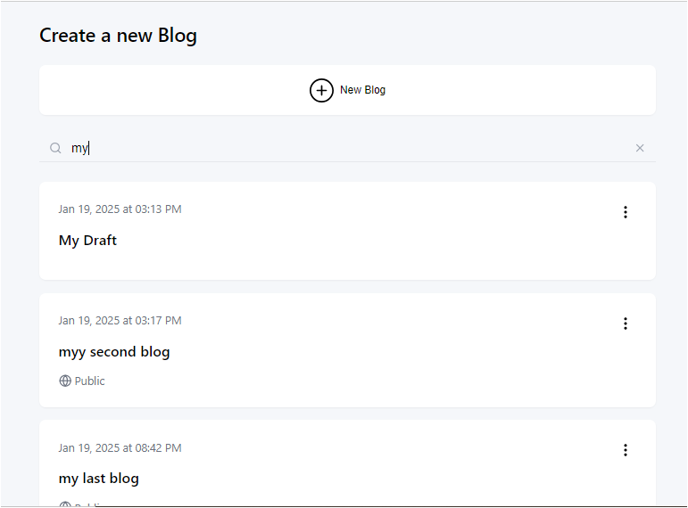

# Blog Management Project

# Introduction

This is a simple Blog Management Project developed using HTML, CSS, and JavaScript. It leverages LocalStorage to manage blog data without requiring a backend server. The application allows users to create, edit, delete, and search for blogs in an intuitive and user-friendly interface.

Features

# 1) Dashboard

Displays a list of blogs categorized as Published and Drafted.

Users can view, edit, or delete blogs directly from the dashboard.

# 2) Create New Blog

Add a new blog with a title and content.

Options to either publish the blog immediately or save it as a draft.

# 3) Edit Blog

Modify the title and content of existing blogs.

Update blog status as Published or Draft.

# 4) Search Functionality

Search blogs using keywords for quick access.

LocalStorage Integration

All blog data is stored in the browser's LocalStorage, ensuring persistence even after a page refresh.

## How to Use

### Access the Dashboard

The homepage displays the dashboard, showing the Published and Drafted blogs in separate tabs.

Use the "New Blog" button to create a new blog.

### Create a New Blog

Click on the "New Blog" button.

Enter the blog title and content in the editor.

Use the dropdown menu to select "Publish now" or "Save as draft."

### Edit or Delete a Blog

Click on the three-dot menu beside any blog entry.

Choose "Edit" to update the blog or "Delete" to remove it.

### Search Blogs

Use the search bar to find blogs by title or content.

# Technical Details

Languages Used: HTML, CSS, JavaScript

Data Storage: LocalStorage

Design Framework: Custom CSS for responsive and clean UI

# Functional Components:

Blog Editor with formatting options (bold, italic, underline, lists, and headings).

Category Tabs for Published and Drafted blogs.

Search bar for keyword-based blog filtering.

# Future Enhancements

Add Categories and Tags

Enable users to categorize and tag blogs for better organization.

Rich-Text Editor

Enhance the editor with advanced formatting options like images and hyperlinks.

Export/Import Functionality

Allow users to export blogs as files or import blogs from external sources.

User Authentication

Add login/signup functionality to make the application multi-user.

Backend Integration

Connect the project to a backend database for scalability and remote access.

This project showcases a basic yet functional implementation of a blogging platform and can serve as a foundation for more advanced applications.

# You can find live site here:
blog-mu-mauve.vercel.app
